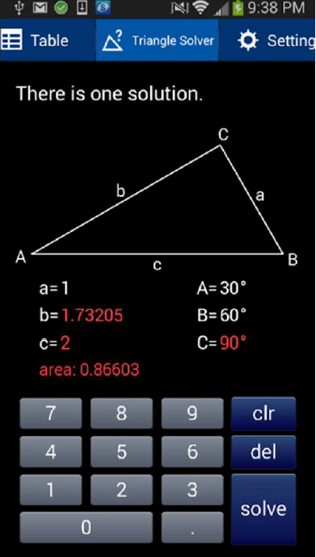

# ENSE 370 Winter 2020 Midterm Exam - Question 1

**PROMPT:** Consider a mobile MathSolver application that looks like that in Fig. Q1. It is able to solve various kinds of Math problems.

This MathSolver application has the following functionalities:

1. **User input**: This functionality tracks the user’s touch on the touchscreen display and determines what screen buttons have been pressed. All the specific
logic of this functionality is captured in a single method called `getUserInput()`.

2. **Solver**: This functionality solves the currently selected math problem using an appropriate algorithm from its library. Each algorithm in the library is an
instance of a class that has a unique integer identifier `algoID` and a method `execute()` to execute it. An appropriate algorithm is selected using the method `getAlgorithm()` and an object of this class is returned. The math problem is solved by calling `solve()` after the algorithm is retrieved.

3. **Display**: This component displays the solution to the user in different possible formats. It can be in graphical form, text form, table form, etc. All the specific logic of this functionality is captured in a single method called `displaySolution()`.

PART A: Design the system such that the code for user input, algorithm used, and display format are **separate**. There should be a public class called `MathSolverDemo` that contains only one method, `main()`. Design any other classes that you may need. Use only one design pattern and state what design pattern you have used. Draw the class diagram. Note that all the methods or attributes mentioned above must appear in your class diagram. You may add any other methods or attributes if you wish.

PART B: Assume that all classes in your design in Part A have been implemented except the public class `MathSolverDemo`. Write the Java implementation of the `MathSolverDemo class`. In your `main()` method, you should create all the necessary object instances in your design, and then call the appropriate methods to (i) get user input, (ii) get an algorithm, (iii) solve the math problem, and (iv) update the display. State any other assumptions that you have made.
