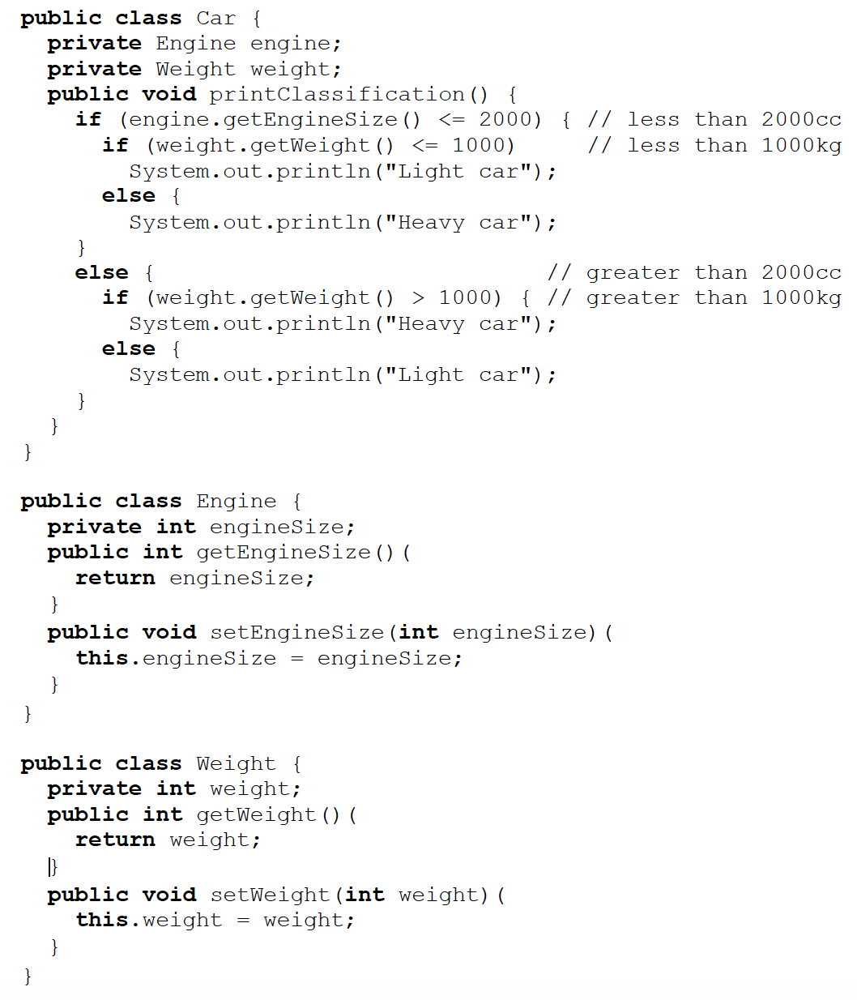

# ENSE 370 Winter 2019 Final Exam - Question 2

**PROMPT:** Consider the following implementation of a `Car` class:

Give at least **two** reasons why the above code is undesirable and refactor it to make it better.
